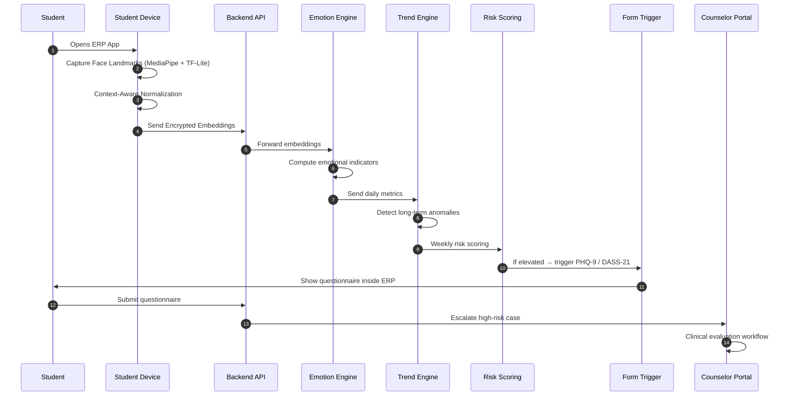
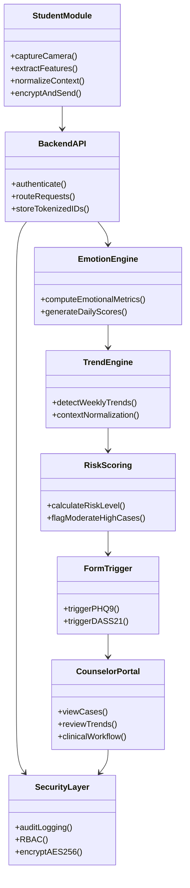

# 🧠 Model Trainer: CNN-Based Image Classification

## Sequence Diagram

```mermaid
sequenceDiagram
    autonumber
    participant Student
    participant Device as Student Device
    participant API as Backend API
    participant EMO as Emotion Engine
    participant TREND as Trend Engine
    participant RISK as Risk Scoring
    participant FORM as Form Trigger
    participant COUNS as Counselor Portal

    Student ->> Device: Opens ERP App
    Device ->> Device: Capture Face Landmarks (MediaPipe + TF-Lite)
    Device ->> Device: Context-Aware Normalization
    Device ->> API: Send Encrypted Embeddings

    API ->> EMO: Forward embeddings
    EMO ->> EMO: Compute emotional indicators
    EMO ->> TREND: Send daily metrics

    TREND ->> TREND: Detect long-term anomalies
    TREND ->> RISK: Weekly risk scoring

    RISK ->> FORM: If elevated → trigger PHQ-9 / DASS-21
    FORM ->> Student: Show questionnaire inside ERP

    Student ->> API: Submit questionnaire
    API ->> COUNS: Escalate high-risk case
    COUNS ->> COUNS: Clinical evaluation workflow
```

## Class Diagram

```mermaid
classDiagram

    class StudentModule {
        +captureCamera()
        +extractFeatures()
        +normalizeContext()
        +encryptAndSend()
    }

    class BackendAPI {
        +authenticate()
        +routeRequests()
        +storeTokenizedIDs()
    }

    class EmotionEngine {
        +computeEmotionalMetrics()
        +generateDailyScores()
    }

    class TrendEngine {
        +detectWeeklyTrends()
        +contextNormalization()
    }

    class RiskScoring {
        +calculateRiskLevel()
        +flagModerateHighCases()
    }

    class FormTrigger {
        +triggerPHQ9()
        +triggerDASS21()
    }

    class CounselorPortal {
        +viewCases()
        +reviewTrends()
        +clinicalWorkflow()
    }

    class SecurityLayer {
        +auditLogging()
        +RBAC()
        +encryptAES256()
    }


    %% Relationships
    StudentModule --> BackendAPI
    BackendAPI --> EmotionEngine
    EmotionEngine --> TrendEngine
    TrendEngine --> RiskScoring
    RiskScoring --> FormTrigger
    FormTrigger --> CounselorPortal
    BackendAPI --> SecurityLayer
    CounselorPortal --> SecurityLayer
```
